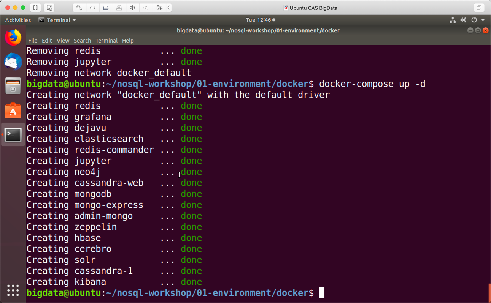

# (Virtual) machine running Ubuntu Linux

This document describes how to install the workshop environment on a Ubuntu Machine, which could be running in a virtual machine, either in the cloud or on your local machine.

## Setup Software

First let's create some environment variables.   

```bash
export GITHUB_PROJECT=event-driven-microservices-workshop
export GITHUB_OWNER=gschmutz
export DATAPLATFORM_HOME=01-environment/docker
export DOCKER_COMPOSE_VERSION=1.29.2
export PLATYS_VERSION=2.4.0
export NETWORK_NAME=<network-name>
```

**Note:** Make sure to replace the `<network-name>` by the value retrieved from `ip addr`, which would be `ens33` in the example below

```
$ ip addr
2: ens33: <BROADCAST,MULTICAST,UP,LOWER_UP> mtu 1500 qdisc fq_codel state UP group default qlen 1000
    link/ether 00:0c:29:3a:82:45 brd ff:ff:ff:ff:ff:ff
    altname enp2s1
```    

### Installing Docker

```bash
# Install Docker
sudo curl -fsSL https://download.docker.com/linux/ubuntu/gpg | sudo apt-key add -
sudo add-apt-repository "deb [arch=amd64] https://download.docker.com/linux/ubuntu $(lsb_release -cs) stable edge"
sudo apt-get install -y docker-ce
sudo usermod -aG docker $USER
```

### Installing Docker Compose

```bash
# Install Docker Compose
sudo curl -L "https://github.com/docker/compose/releases/download/${DOCKER_COMPOSE_VERSION}/docker-compose-$(uname -s)-$(uname -m)" -o /usr/local/bin/docker-compose
sudo chmod +x /usr/local/bin/docker-compose
sudo ln -s /usr/local/bin/docker-compose /usr/bin/docker-compose
```

### Installing Platys

```bash
# Install Platys
sudo curl -L "https://github.com/TrivadisPF/platys/releases/download/${PLATYS_VERSION}/platys_${PLATYS_VERSION}_linux_x86_64.tar.gz" -o /tmp/platys.tar.gz
tar zvxf /tmp/platys.tar.gz 
sudo mv platys /usr/local/bin/
sudo chown root:root /usr/local/bin/platys
sudo rm README.md 
```

### Install some helpful utilities

```bash
# Install various Utilities
sudo apt-get install -y curl jq kafkacat
```

## Prepare Environment

In the Virtual Machine, start a terminal window and execute the following commands. 

First let's add the environment variables. Make sure to adapt the network interface (**ens33** according to your environment. You can retrieve the interface name by using **ipconfig** on windows or **ifconfig** / **ip addr** on Mac/Linux. 

If your virtual machine is running in the cloud, where there is a specific public IP address to reach it, perform this command

```bash
export PUBLIC_IP=$(curl ipinfo.io/ip)
```

otherwise this command (make sure that `$NETWORK_NAME` has been set correctly)

```bash
export PUBLIC_IP=$(ip addr show $NETWORK_NAME | grep "inet\b" | awk '{print $2}' | cut -d/ -f1)
```

Additionally set the `DOCKER_HOST_IP` to the IP address of the machine (make sure that `$NETWORK_NAME` has been set correctly)

```bash
export DOCKER_HOST_IP=$(ip addr show $NETWORK_NAME | grep "inet\b" | awk '{print $2}' | cut -d/ -f1)
```

Now let's checkout the Event-Driven Microservices Workshop project from GitHub:

```
# Get the project
cd 
git clone https://github.com/gschmutz/event-driven-microservices-workshop.git
cd event-driven-microservices-workshop/01-environment/docker/
export $DATAPLATFORM_HOME=$PWD
```

Finally let's persist the 3 environment variables `PUBLIC_IP`, `DOCKER_HOST_IP` and `DATAPLATFORM_HOME`, so that they are available after a logout.

```bash
# Prepare Environment Variables into .bash_profile file
printf "export PUBLIC_IP=$PUBLIC_IP\n" >> /home/$USER/.bash_profile
printf "export DOCKER_HOST_IP=$DOCKER_HOST_IP\n" >> /home/$USER/.bash_profile
printf "export DATAPLATFORM_HOME=$DATAPLATFORM_HOME\n" >> /home/$USER/.bash_profile
printf "\n" >> /home/$USER/.bash_profile
sudo chown ${USER}:${USER} /home/$USERNAME/.bash_profile
```

For Elasticsearch to run properly, we have to increase the `vm.max_map_count` parameter like shown below.  

```bash
# needed for elasticsearch
sudo sysctl -w vm.max_map_count=262144   
```

Now with the environment prepared, we can start the Docker Compose stack.

## Start Environment

Start the environment by beforming a `docker-compose up`

```
# Make sure that the environment is not running
docker-compose down

# Startup Environment in detached mode (background)
docker-compose up -d
```

If started the first time, the necessary docker images will be downloaded from the public docker registry. Therefore you need internet access from your machine.

Once this is done, the docker container will start one by one, and at the end the output should be similar to the one below. 



Your instance is now ready to use. Complete the post installation steps documented the [here](README.md).

## Stop environment

To stop the environment, execute the following command:

```
docker-compose stop
```

after that it can be re-started using `docker-compose start`.

## Remove the environment

To stop and remove all running container, execute the following command:

```
docker-compose down
```


