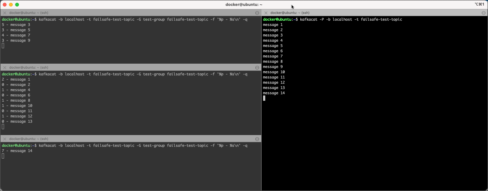
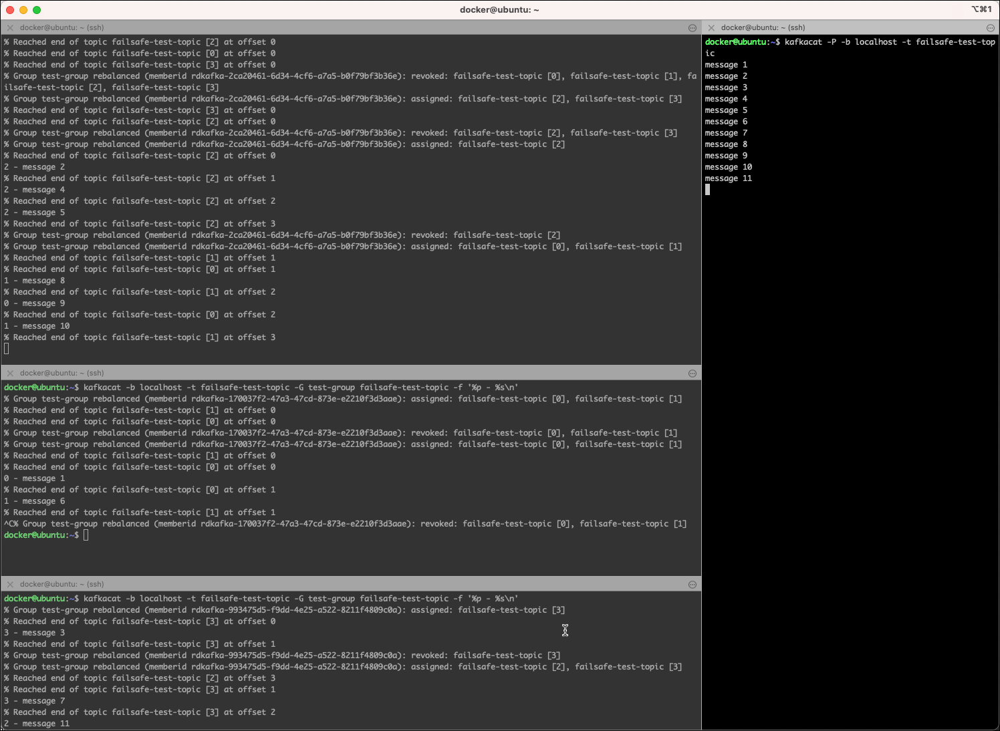
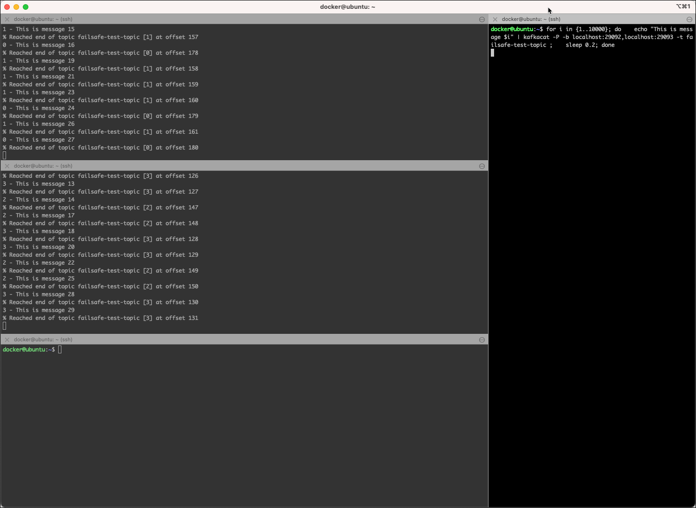
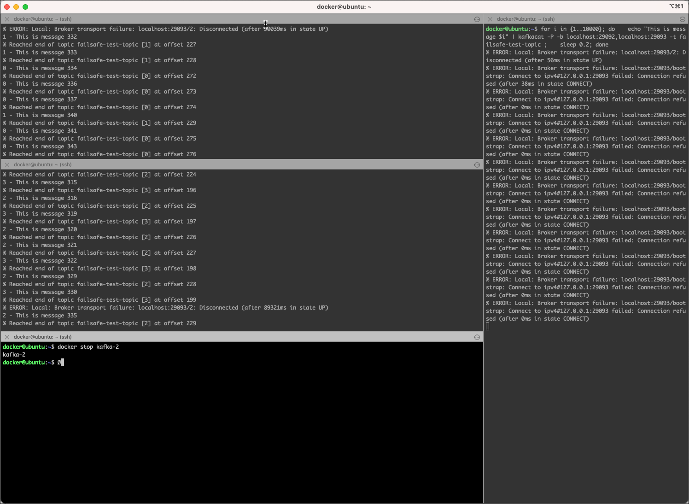

# Testing Kafka Scalability and Failover

In this tutorial, we will demonstrate consumer failover and broker failover. We also demonstrate load balancing Kafka consumers. We show how, with many groups, Kafka acts like a Publish/Subscribe. But, when we put all of our consumers in the same group, Kafka will load share the messages to the consumers in the same group (more like a queue than a topic in a traditional MOM sense).

For the exercise we will be using the `kafkacat` command line utility we have learned about in [Working with Apache Kafka Broker](../02-working-with-kafka-broker/README.md). 
    
## Create Kafka replicated topic my-failsafe-topic 

First let's create the topic we will use throughout this workshop.

Execute the `kafka-topics` CLI in the `kafka-1` docker container

```bash
docker exec -ti kafka-1 kafka-topics --create \
    --zookeeper zookeeper-1:2181 \
    --replication-factor 3 \
    --partitions 4 \
    --topic failsafe-test-topic
```

**Note:** replication factor is set to `3`, and the topic name is `failsafe-test-topic`.

## Kafka Producer with multiple logical Consumers

First let's test a scenario with 1 producer and 3 different logical consumers, each using a differnt consumer group (we don't specify it and therefore a new one is generated with each consumer).

### Start the 1st Kafka Consumer that uses Replicated Topic

Start a consumer using `kafkacat` on the topic `failsafe-test-topic`. Use the `-o end` switch to read only from the end. 

```bash
kafkacat -b localhost -t failsafe-test-topic -o end
```

or if using docker

```bash
docker exec -ti kafkacat kafkacat -b kafka-1:19092 -t failsafe-test-topic -o end
```

### Start a Kafka Producer that uses Replicated Topic

Start the producer using `kafkacat` 

```
kafkacat -P -b localhost -t failsafe-test-topic
```

and produce 3 messages

```bash
cas@cas ~> kafkacat -P -b localhost -t failsafe-test-topic
Hello World!
Hello Events!
Hello Kafka!
```

in the consumer console started above you should see the 3 messages

```bash
cas@cas ~> kafkacat -b localhost -t failsafe-test-topic -o end
Hello World!
Hello Events!
Hello Kafka!
```

### Start two more consumers and send more messages

Start two more consumers in their own terminal windows 

```bash
kafkacat -b localhost -t failsafe-test-topic -o end
```

Then send more messages from the producer

```bash
cas@cas ~> kafkacat -P -b localhost -t failsafe-test-topic
Hello World!
Hello Events!
Hello Kafka!
message new 1
message new 2
message new 3
```

#### Consumer Console 1st

```bash
cas@cas ~> kafkacat -b localhost -t failsafe-test-topic -o end
Hello World!
Hello Events!
Hello Kafka!
message new 1
message new 2
message new 3
```

#### Consumer Console 2nd

```bash
cas@cas ~> kafkacat -b localhost -t failsafe-test-topic -o end
message new 1
message new 2
message new 3
```

#### Consumer Console 3rd

```bash
cas@cas ~> kafkacat -b localhost -t failsafe-test-topic -o end
message new 1
message new 2
message new 3
```

Notice that the messages are sent to all of the consumers because each consumer is in **a different consumer group**.

Stop the producers and the consumers from before.

## Kafka Producer with multiple Consumer in same Consumer Group

Now let’s start the console consumers to use the same consumer group. This way the consumers will be competing consumers, as each consumer in the consumer group will get its share of partitions. With `kafkacat` you can specify the consumer group name by using the `-G` option. ¨

### Start the 3 consumers in the same group

Start 3 consumers using the same `test-group` consumer group by running the following command in 3 different terminal windows. We are showing the partition and the value of the message 

```bash
kafkacat -b localhost -t failsafe-test-topic -G test-group failsafe-test-topic -f '%p - %s\n'
```

In each of the `kafkacat` consumers you will see messages similar to these two:

The first one shows the assignement of a one or more partions during a rebalance operation

```bash
% Group test-group rebalanced (memberid rdkafka-2ca20461-6d34-4cf6-a7a5-b0f79bf3b36e): assigned: failsafe-test-topic [2]
```

and the second one a revoke of one or more partitions during a rebalance operation

```bash
% Group test-group rebalanced (memberid rdkafka-2ca20461-6d34-4cf6-a7a5-b0f79bf3b36e): revoked: failsafe-test-topic [2], failsafe-test-topic [3]
```

### Produce Messages

In another terminal window, start the producer using `kafkacat` 

```bash
kafkacat -P -b localhost -t failsafe-test-topic
```

and produce a few messages

```bash
cas@cas ~> kafkacat -P -b localhost -t failsafe-test-topic
message 1
message 2
message 3
message 4
message 5
message 6
```

you should see that each message should only be consumed by one of the 3 consumers and that each consumer consumes it own share of partitions from the `failsafe-test-topic` topic, as show in the following diagram



### Kafka Consumer Failover

Now let’s see consumer failover in action by killing one of the consumers and sending some more messages. Kafka should divide up the work to the consumers that are running.

First, kill the 2nd consumer (CTRL-C in the consumer terminal does the trick). In the case shown here, the 2nd consumer was consuming from partition `0` and `1`. 

These two partitions will be assigned to one of the 2 remaining consumers. You will again see some  re-balance message, showing that these consumers have gotten new partitions assigned.

```
% Group test rebalanced (memberid rdkafka-c6b9607c-fe47-4ffa-b2aa-c783787eedbe): revoked: failsafe-test-topic [3], failsafe-test-topic [4], failsafe-test-topic [5]
% Group test rebalanced (memberid rdkafka-c6b9607c-fe47-4ffa-b2aa-c783787eedbe): assigned: failsafe-test-topic [0], failsafe-test-topic [1], failsafe-test-topic [2], failsafe-test-topic [3]
```

Now send a few more messages from the producer terminal.



Notice that the messages are spread evenly among the 2 remaining consumers.

We killed one consumer, sent more messages, and saw Kafka spread the load to remaining consumers. Kafka consumer failover works!

## Kafka Broker Failover

Now let's see what happens if we kill one of the 3 Kafka brokers of the cluster.

### Describe Topic

We are going to lists which broker owns (leader of) which partition, and list replicas and ISRs of each partition. ISRs are replicas that are so-called in-sync, meaning that they are up to date. 

Remember that our topic holds 4 partitions with replaction factor of 3.

Let's see the distribution of these 4 partitions over the brokers using the `--describe` option of the `kafka-topics` command

```bash
docker exec -ti kafka-1 kafka-topics --describe \
    --topic failsafe-test-topic \
    --zookeeper zookeeper-1:2181
```    

We can see that that `kafka-1` is the leader for Partion 1, whereas `kakfa-2` is the leader for Partition 2 and `kafka-3` is the leader for Partition 0 and Partioin 3. 

```bash
Topic: failsafe-test-topic	TopicId: KA_b-48OStOgIHhPMBqohg	PartitionCount: 4	ReplicationFactor: 3	Configs:
	Topic: failsafe-test-topic	Partition: 0	Leader: 3	Replicas: 3,1,2	Isr: 3,1,2
	Topic: failsafe-test-topic	Partition: 1	Leader: 1	Replicas: 1,2,3	Isr: 1,2,3
	Topic: failsafe-test-topic	Partition: 2	Leader: 2	Replicas: 2,3,1	Isr: 2,3,1
	Topic: failsafe-test-topic	Partition: 3	Leader: 3	Replicas: 3,2,1	Isr: 3,2,1
```

Because we use replication factor 3 on the `failsafe-test-topic` a replica of each Partition is avialble on 3 brokers. This is a special case if the replication factor matches the number of brokers in the cluster (both are 3 in our case). 

### Start 2 consumers

In 2 different terminal windows, start a consumer with consumer group `test-group`.

```bash
kafkacat -b localhost:29092,localhost:29093 -t failsafe-test-topic -G test-group failsafe-test-topic -f '%p - %s\n'
```

**Note:** we specify two borkers in the broker list (`-b` option).

### Start a producer

In another terminal, let's run a Kafka producer inside a loop to produce 10'000 messages

```bash
for i in {1..10000}
do
   echo "This is message $i" | kafkacat -P -b localhost:29092,localhost:29093 -t failsafe-test-topic 
   sleep 0.5
done 
```
**Note:** we specify two borkers in the broker list (`-b` option).

You should see that both consumers share the consumption of the messages. 



This represents normal behaviour. 

### Test Broker Failover by killing the 2nd broker

Let’s kill the 2nd broker and see what happens

```bash
docker stop kafka-2
```

In the terminal windows of both the consumers and the producer you will get error messages, due to the fact that broker-2 is no longer available. 



But you can also see that both the producer and the two consumers continue to work. Let's see what happend behind the scences by describing the topic

```bash
docker exec -ti kafka-1 kafka-topics --describe \
    --topic failsafe-test-topic \
    --zookeeper zookeeper-1:2181
```  

We can see that `kafka-2` is no longer a leader for any of the partitions. Before the shutdown `kafka-2` was the leader for Partion 2. Additionally the Isr list has been reduced to broker 3 and 1 (the two remaining brokers). 

```bash
$ docker exec -ti kafka-1 kafka-topics --describe     --topic failsafe-test-topic     --zookeeper zookeeper-1:2181
Topic: failsafe-test-topic	TopicId: KA_b-48OStOgIHhPMBqohg	PartitionCount: 4	ReplicationFactor: 3	Configs:
	Topic: failsafe-test-topic	Partition: 0	Leader: 3	Replicas: 3,1,2	Isr: 3,1
	Topic: failsafe-test-topic	Partition: 1	Leader: 1	Replicas: 1,2,3	Isr: 3,1
	Topic: failsafe-test-topic	Partition: 2	Leader: 3	Replicas: 2,3,1	Isr: 3,1
	Topic: failsafe-test-topic	Partition: 3	Leader: 3	Replicas: 3,2,1	Isr: 3,1
```

Let's fix the situation by restarting `kafka-2`

```bash
docker start kafka-2
```

Let's see if the situation has been normalized by executing another descirbe of the topic

```bash
docker exec -ti kafka-1 kafka-topics --describe \
    --topic failsafe-test-topic \
    --zookeeper zookeeper-1:2181
```  

We can see that the Isr list again holds all 3 brokers, so all of the replicas are again in sync (including the one on `kafka-2`). If you don't see that result, just retry, as it might take a while for the situation to recover.

```bash
$ docker exec -ti kafka-1 kafka-topics --describe     --topic failsafe-test-topic     --zookeeper zookeeper-1:2181
Topic: failsafe-test-topic	TopicId: KA_b-48OStOgIHhPMBqohg	PartitionCount: 4	ReplicationFactor: 3	Configs:
	Topic: failsafe-test-topic	Partition: 0	Leader: 3	Replicas: 3,1,2	Isr: 3,1,2
	Topic: failsafe-test-topic	Partition: 1	Leader: 1	Replicas: 1,2,3	Isr: 3,1,2
	Topic: failsafe-test-topic	Partition: 2	Leader: 3	Replicas: 2,3,1	Isr: 3,1,2
	Topic: failsafe-test-topic	Partition: 3	Leader: 3	Replicas: 3,2,1	Isr: 3,1,2
```

But there is one thing which does not yet reflect the situation before "loosing" broker 2: `kafka-2` is not a leader for Partition 2! Kafka knows about the prefered replicas, meaning which borker should be the leader. We can perform a leader election by performing the following command with the partition we want to run the prefered leader election on.  

```bash
docker exec -ti kafka-1 kafka-leader-election \
  --bootstrap-server kafka-1:19092 \
  --topic failsafe-test-topic \
  --partition 2 \
  --election-type preferred
```

After that repeat the describe and now `kafka-2` should be again the leader for Partition 2:

```bash
$ docker exec -ti kafka-1 kafka-topics --describe     --topic failsafe-test-topic     --zookeeper zookeeper-1:2181
Topic: failsafe-test-topic	TopicId: KA_b-48OStOgIHhPMBqohg	PartitionCount: 4	ReplicationFactor: 3	Configs:
	Topic: failsafe-test-topic	Partition: 0	Leader: 3	Replicas: 3,1,2	Isr: 3,1,2
	Topic: failsafe-test-topic	Partition: 1	Leader: 1	Replicas: 1,2,3	Isr: 3,1,2
	Topic: failsafe-test-topic	Partition: 2	Leader: 2	Replicas: 2,3,1	Isr: 3,1,2
	Topic: failsafe-test-topic	Partition: 3	Leader: 3	Replicas: 3,2,1	Isr: 3,1,2
```

During all of these operations, you should see no effect on the producer and the two consumers. The continue to run normally.

