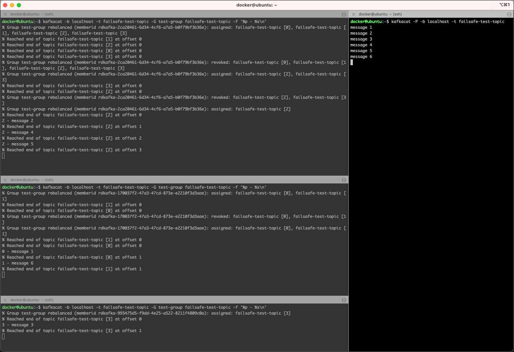

# Testing Kafka Scalability and Failover

In this tutorial, we will demonstrate consumer failover and broker failover. We also demonstrate load balancing Kafka consumers. We show how, with many groups, Kafka acts like a Publish/Subscribe. But, when we put all of our consumers in the same group, Kafka will load share the messages to the consumers in the same group (more like a queue than a topic in a traditional MOM sense).

For the exercise we will be using the `kafkacat` command line utility we have learned about in [Working with Apache Kafka Broker](../02-working-with-kafka-broker/README.md). 
    
## Create Kafka replicated topic my-failsafe-topic 

First let's create the topic we will use throughout this workshop.

Execute the `kafka-topics` CLI in the `kafka-1` docker container

```bash
docker exec -ti kafka-1 kafka-topics --create \
    --zookeeper zookeeper-1:2181 \
    --replication-factor 3 \
    --partitions 4 \
    --topic failsafe-test-topic
```

**Note:** replication factor is set to `3`, and the topic name is `failsafe-test-topic`.

## Kafka Producer with multiple logical Consumers

First let's test a scenario with 1 producer and 3 different logical consumers, each using a differnt consumer group (we don't specify it and therefore a new one is generated with each consumer).

### Start the 1st Kafka Consumer that uses Replicated Topic

Start a consumer using `kafkacat` on the topic `failsafe-test-topic`. Use the `-o end` switch to read only from the end. 

```bash
kafkacat -b localhost -t failsafe-test-topic -o end
```

or if using docker

```bash
docker exec -ti kafkacat kafkacat -b kafka-1:19092 -t failsafe-test-topic -o end
```

### Start a Kafka Producer that uses Replicated Topic

Start the producer using `kafkacat` 

```
kafkacat -P -b localhost -t failsafe-test-topic
```

and produce 3 messages

```bash
cas@cas ~> kafkacat -P -b localhost -t failsafe-test-topic
Hello World!
Hello Events!
Hello Kafka!
```

in the consumer console started above you should see the 3 messages

```bash
cas@cas ~> kafkacat -b localhost -t failsafe-test-topic -o end
Hello World!
Hello Events!
Hello Kafka!
```

### Start two more consumers and send more messages

Start two more consumers in their own terminal windows 

```bash
kafkacat -b localhost -t failsafe-test-topic -o end
```

Then send more messages from the producer

```bash
cas@cas ~> kafkacat -P -b localhost -t failsafe-test-topic
Hello World!
Hello Events!
Hello Kafka!
message new 1
message new 2
message new 3
```

#### Consumer Console 1st

```bash
cas@cas ~> kafkacat -b localhost -t failsafe-test-topic -o end
Hello World!
Hello Events!
Hello Kafka!
message new 1
message new 2
message new 3
```

#### Consumer Console 2nd

```bash
cas@cas ~> kafkacat -b localhost -t failsafe-test-topic -o end
message new 1
message new 2
message new 3
```

#### Consumer Console 3rd

```bash
cas@cas ~> kafkacat -b localhost -t failsafe-test-topic -o end
message new 1
message new 2
message new 3
```

Notice that the messages are sent to all of the consumers because each consumer is in **a different consumer group**.

Stop the producers and the consumers from before.

## Kafka Producer with multiple Consumer in same Consumer Group

Now let’s start the console consumers to use the same consumer group. This way the consumers will be competing consumers, as each consumer in the consumer group will get its share of partitions. With `kafkacat` you can specify the consumer group name by using the `-G` option. ¨

### Start the 3 consumers in the same group

Start 3 consumers using the same `test-group` consumer group by running the following command in 3 different terminal windows. We are showing the partition and the value of the message 

```bash
kafkacat -b localhost -t failsafe-test-topic -G test-group failsafe-test-topic -f '%p - %s\n'
```

In each of the `kafkacat` consumers you will see messages similar to these two:

* The first one shows the assignement of a one or more partions during a rebalance operation

	```bash
% Group test-group rebalanced (memberid rdkafka-2ca20461-6d34-4cf6-a7a5-b0f79bf3b36e): assigned: failsafe-test-topic [2]
```

* and the second one a revoke of one or more partitions during a rebalance operation

	```bash
% Group test-group rebalanced (memberid rdkafka-2ca20461-6d34-4cf6-a7a5-b0f79bf3b36e): revoked: failsafe-test-topic [2], failsafe-test-topic [3]
```

### Produce Messages

In another terminal window, start the producer using `kafkacat` 

```bash
kafkacat -P -b localhost -t failsafe-test-topic
```

and produce a few messages

```bash
cas@cas ~> kafkacat -P -b localhost -t failsafe-test-topic
message 1
message 2
message 3
message 4
message 5
message 6
message 7
message 8
message 9
message 10
message 11
message 12
message 13
message 14
```

you should see that each message should only be consumed by one of the 3 consumers and that each consumer consumes it own share of partitions from the `failsafe-test-topic` topic, as show in the following diagram



### Kafka Consumer Failover

Now let’s see consumer failover in action by killing one of the consumers and sending some more messages. Kafka should divide up the work to the consumers that are running.

First, kill the 2nd consumer (CTRL-C in the consumer terminal does the trick).

In the remaining two consumer terminals, you should get a re-balance message, showing that these consumers have gotten new partitions assigned.

```
% Group test rebalanced (memberid rdkafka-c6b9607c-fe47-4ffa-b2aa-c783787eedbe): revoked: failsafe-test-topic [3], failsafe-test-topic [4], failsafe-test-topic [5]
% Group test rebalanced (memberid rdkafka-c6b9607c-fe47-4ffa-b2aa-c783787eedbe): assigned: failsafe-test-topic [0], failsafe-test-topic [1], failsafe-test-topic [2], failsafe-test-topic [3]
```

Now send 5 more messages with the Kafka console-producer.

Notice that the messages are spread evenly among the remaining consumers.

We killed one consumer, sent more messages, and saw Kafka spread the load to remaining consumers. Kafka consumer failover works!

## Kafka Broker Failover

### Describe Topic
We are going to lists which broker owns (leader of) which partition, and list replicas and ISRs of each partition. ISRs are replicas that are up to date. Remember there are 8 partitions.

Connect to the `kafka-1` container:

```bash
docker exec -ti kafka-1 bash
```

And create the topic. 

```bash
kafka-topics --describe \
    --topic failsafe-test-topic \
    --zookeeper zookeeper-1:2181
```    

```bash
Topic:failsafe-test-topic	PartitionCount:8	ReplicationFactor:3	Configs:
	Topic: failsafe-test-topic	Partition: 0	Leader: 3	Replicas: 3,2,1	Isr: 3,2,1
	Topic: failsafe-test-topic	Partition: 1	Leader: 1	Replicas: 1,3,2	Isr: 1,3,2
	Topic: failsafe-test-topic	Partition: 2	Leader: 2	Replicas: 2,1,3	Isr: 2,1,3
	Topic: failsafe-test-topic	Partition: 3	Leader: 3	Replicas: 3,1,2	Isr: 3,1,2
	Topic: failsafe-test-topic	Partition: 4	Leader: 1	Replicas: 1,2,3	Isr: 1,2,3
	Topic: failsafe-test-topic	Partition: 5	Leader: 2	Replicas: 2,3,1	Isr: 2,1,3
	Topic: failsafe-test-topic	Partition: 6	Leader: 3	Replicas: 3,2,1	Isr: 3,2,1
	Topic: failsafe-test-topic	Partition: 7	Leader: 1	Replicas: 1,3,2	Isr: 1,3,2
```

Notice how each broker gets a share of the partitions as leaders and followers. Also, see how Kafka replicates the partitions on each broker.

### Test Broker Failover by killing 1st server

Let’s kill the 2nd broker, and then test the failover.

```bash
docker stop kafka-2
```

Now that the first Kafka broker has stopped, let’s use Kafka topics describe to see that new leaders were elected!

```bash
Topic:failsafe-test-topic	PartitionCount:8	ReplicationFactor:3	Configs:
	Topic: failsafe-test-topic	Partition: 0	Leader: 3	Replicas: 3,2,1	Isr: 3,1
	Topic: failsafe-test-topic	Partition: 1	Leader: 1	Replicas: 1,3,2	Isr: 1,3
	Topic: failsafe-test-topic	Partition: 2	Leader: 1	Replicas: 2,1,3	Isr: 1,3
	Topic: failsafe-test-topic	Partition: 3	Leader: 3	Replicas: 3,1,2	Isr: 3,1
	Topic: failsafe-test-topic	Partition: 4	Leader: 1	Replicas: 1,2,3	Isr: 1,3
	Topic: failsafe-test-topic	Partition: 5	Leader: 3	Replicas: 2,3,1	Isr: 1,3
	Topic: failsafe-test-topic	Partition: 6	Leader: 3	Replicas: 3,2,1	Isr: 3,1
	Topic: failsafe-test-topic	Partition: 7	Leader: 1	Replicas: 1,3,2	Isr: 1,3
```

You can see that `kafka-2` is no longer a leader for any of the partitions. 

Let’s prove that failover worked by sending two more messages from the producer console. Notice if the consumers still get the messages.

## Kafka Cluster Failover Review

- Why did the three consumers not load share the messages at first?
- How did we demonstrate failover for consumers?
- How did we show failover for producers?
- What tool and option did we use to show ownership of partitions and the ISRs?