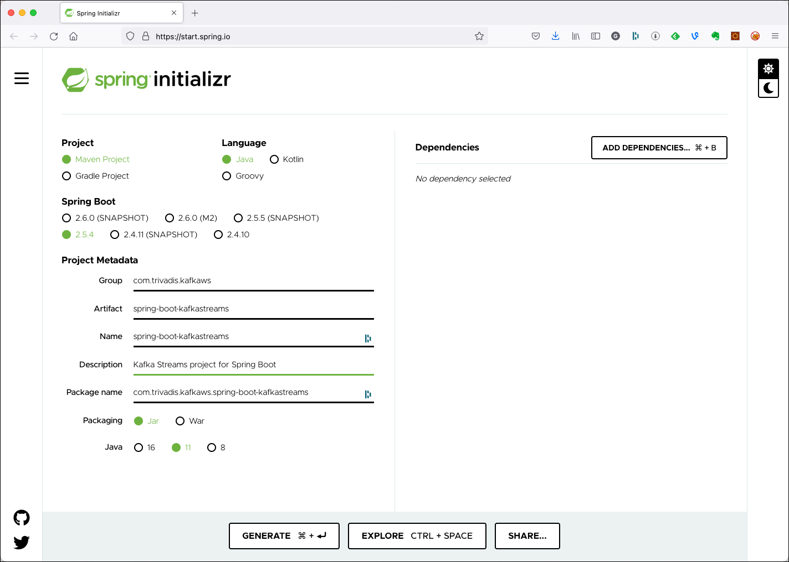
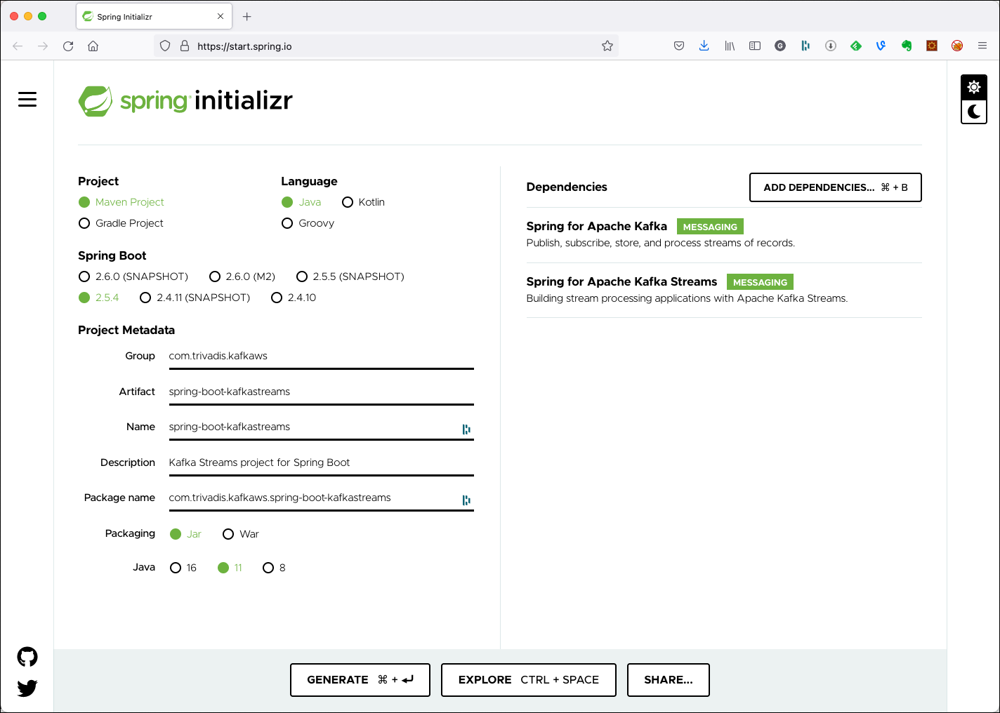

# Using Kafka Streams from Spring Boot

In this workshop we will learn how to process messages using the [KafkaStreams](https://kafka.apache.org/documentation/streams/) library from Spring Boot. 

We will create a Spring Boot application and implememt the same basic processor from Workshop 7 which consumes messages from a topic, processes them and produces the result into a new topic. We will be using the High-Level DSL.

## Create the Spring Boot Project

First, let’s navigate to [Spring Initializr](https://start.spring.io/) to generate our project. Our project will need the Apache Kafka support. 

Select Generate a **Maven Project** with **Java** and Spring Boot **2.5.4**. Enter `com.trivadis.kafkaws.kstream` for the **Group**, `spring-boot-kafkastreams` for the **Artifact** field and `Kafka Streams project for Spring Boot` for the **Description** field. 



Click on **Add Dependencies** and search for the  **Spring for Apache Kafka** depencency. Select the dependency and hit the **Enter** key. Click on **Add Dependencies** once more and search for the  **Spring for Apache Kafka Streams** depencency and add it as well. 

You should now see the dependency on the right side of the screen.



Click on **Generate Project** and unzip the ZIP file to a convenient location for development. Once you have unzipped the project, you’ll have a very simple structure. 

Import the project as a Maven Project into your favourite IDE for further development. 

## Create the necessary Kafka Topic 

We will use the topic `test-kstream-spring-input-topic` and `test-kstream-spring-output-topic` in the KafkaStream processorcode below. Due to the fact that `auto.topic.create.enable` is set to `false`, we have to manually create the topic. 

Connect to the `kafka-1` container and execute the necessary kafka-topics command. 

```bash
docker exec -ti kafka-1 kafka-topics --create \
    --replication-factor 3 \
    --partitions 8 \
    --topic test-kstream-spring-input-topic \
    --zookeeper zookeeper-1:2181
    
docker exec -ti kafka-1 kafka-topics --create \
    --replication-factor 3 \
    --partitions 8 \
    --topic test-kstream-spring-output-topic \
    --zookeeper zookeeper-1:2181
```

Next we will implement the KafkaStreams Processor Topology using the DSL and second using the Processor API.

## Implementing the Kafka Streams Processor using the DSL

Create a new Java package `com.trivads.kafkaws.kstream.simple` and in it a Java class `KafkaStreamsRunnerDSL`. 

Add the following code for the implemenation

```java
package com.trivadis.kafkaws.springbootkafkastreams.simple;

import org.apache.kafka.streams.StreamsBuilder;
import org.apache.kafka.streams.kstream.KStream;
import org.apache.kafka.streams.kstream.Printed;
import org.springframework.context.annotation.Bean;
import org.springframework.context.annotation.Configuration;
import org.springframework.kafka.annotation.EnableKafkaStreams;

@Configuration
@EnableKafkaStreams
public class KafkaStreamsRunnerDSL {

    private static final String INPUT_TOPIC_NAME = "test-kstream-spring-input-topic";
    private static final String OUTPUT_TOPIC_NAME = "test-kstream-spring-output-topic";

    @Bean
    public KStream<Void, String> kStream(StreamsBuilder kStreamBuilder) {
        KStream<Void, String> stream = kStreamBuilder.stream(INPUT_TOPIC_NAME);

        // transform the values to upper case
        KStream<Void, String> upperStream = stream.mapValues(value -> value.toUpperCase());

        // print the result to the console using the `print` operator
        upperStream.print(Printed.<Void, String>toSysOut().withLabel("upperValue"));

        // publish to the output topic
        upperStream.to(OUTPUT_TOPIC_NAME);

        return stream;
    }
}
```

In standard Spring Boot way, you can see that using Kafka Streams is much simpler than with plain Java. But of course the configuration is still missing. The necessary settings will go into the `application.yml` file.

### Configure Kafka through application.yml configuration file

First let's rename the existing `application.properties` file to `application.yml` to use the `yml` format. 

Add the following settings to configure the Kafka cluster as well as the Kafka Streams application:

```yml
spring:
  application:
    name: "spring-boot-kafkastreams"

  kafka:
    bootstrap-servers: ${DATAPLATFORM_IP}:9092
    streams:
      application-id: ${spring.application.name}
      client-id: ${spring.application.name}-stream
      properties:
        default.key.serde: org.apache.kafka.common.serialization.Serdes$VoidSerde
        default.value.serde: org.apache.kafka.common.serialization.Serdes$StringSerde
        # This is the default: log, fail and stop processing records (stop stream)
        default.deserialization.exception.handler: org.apache.kafka.streams.errors.LogAndFailExceptionHandler
    properties:
      bootstrap.servers: ${spring.kafka.bootstrap-servers}
    # At application startup a missing topic on the broker will not fail the
    # application startup
    listener:
      missing-topics-fatal: false
```

For the IP address of the Kafka cluster we refer to an environment variable, which we have to declare before running the application.

```bash
export DATAPLATFORM_IP=nnn.nnn.nnn.nnn
```

## Build & Run the application

First lets build the application:

```bash
mvn package -Dmaven.test.skip=true
```

Now let's run the application

```bash
mvn spring-boot:run
```

## Use Console to test the application

Start the programm and then first run a `kafkacat` consumer on the output topic

```bash
kafkacat -b dataplatform:9092 -t test-kstream-spring-output-topic
```

with that in place, in 2nd terminal produce some messages using `kafkacat` in producer mode on the input topic

```bash
kafkacat -b dataplatform:9092 -t test-kstream-input-topic -P
```

All the values produced should arrive on the consumer in uppercase.

